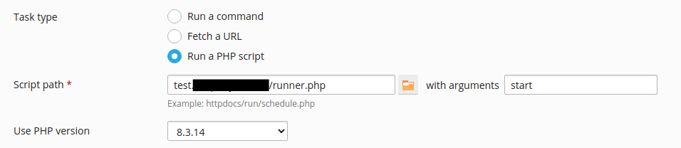

# Setup

1. Upload files to any subscription
2. Configure the schedule task
3. 

# Expected output

```
Task "test.xyz.tld/runner.php" successfully completed in 0 seconds, output:

Runner started
Starting worker
Runner finished
```

**worker.log**:
```
Worker started
Worker will run 4 iterations
Sleeping for 2 seconds
cef3c2c437c9bb0ae5be137c653c3071Iteration 0
Sleeping for 3 seconds
709056c2c95ebc1f16b210d370a04d0bIteration 1
Sleeping for 2 seconds
65c39ea119544878e3a0c865b62405b1Iteration 2
Sleeping for 1 seconds
85d7810c51b2132086b6aecbe5d657b0Iteration 3
Worker finished

```

# Actual output

```
Task "test.xyz.tld/runner.php" successfully completed in 0 seconds, output:

Runner started
Starting worker
Runner finished
```

**worker.log**:
```
Worker started
Worker will run 6 iterations
Sleeping for 3 seconds

```